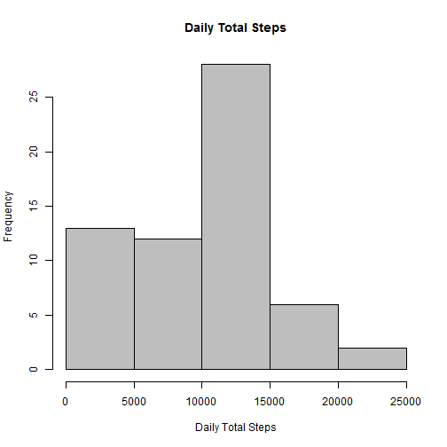

Explore Activity Monitoring Data
========================================================  
Reproducible Research: Peer Assignment 1


### Loading and preprocessing the data

```r
indata <- read.table("./activity.csv", header = T, sep = ",", 
                     na.strings="NA",  colClasses=c(date="Date"))
str(indata)
```

```
## 'data.frame':	17568 obs. of  3 variables:
##  $ steps   : int  NA NA NA NA NA NA NA NA NA NA ...
##  $ date    : Date, format: "2012-10-01" "2012-10-01" ...
##  $ interval: int  0 5 10 15 20 25 30 35 40 45 ...
```
Sum up steps by date (ignore NA)

```r
dailystep <- aggregate(steps~date, data = indata, FUN = "sum", na.rm=TRUE)
```

### What is mean total number of steps taken per day?
Make a histogram of the total number of steps taken each day

```r
hist(dailystep$steps,
     col = "red", 
     xlab = "Daily Total Steps",
     main = "Daily Total Steps")             
```


Mean and median number of steps taken each day

```r
mean(dailystep$steps)
```

```
## [1] 10766.19
```

```r
median(dailystep$steps)
```

```
## [1] 10765
```
### What is the average daily activity pattern?
Make a time series plot (i.e. type = "l") of the 5-minute interval (x-axis) and the average number of steps taken, averaged across all days (y-axis)

```r
TS <- tapply(indata$steps, indata$interval, mean, na.rm = TRUE)
ts <- cbind(interval = unique(indata$interval), avg_steps = TS)
plot( x=ts[,1], 
      y = ts[,2], 
      type = "l", 
      xlab = "5-mins interval", 
      ylab = "average number of steps taken",
      main = "average daily activity pattern"
      ) 
```


Which 5-minute interval, on average across all the days in the dataset, contains the maximum number of steps?

```r
names(which.max(ts[,2]))
```

```
## [1] "835"
```
### Imputing missing values
Calculate and report the total number of missing values in the dataset (i.e. the total number of rows with NAs)

```r
sum(is.na(indata)) 
```

```
## [1] 2304
```
filling in all of the missing values in the dataset with median
Create a new dataset that is equal to the original dataset but with the missing data filled in

```r
Impute = indata
Impute$steps[is.na(Impute$steps)] = median(indata$steps, na.rm=TRUE)
```
Make a histogram of the total number of steps taken each day and Calculate and report the mean and median total number of steps taken per day.

```r
dailystep.Imp <- aggregate(steps~date, data = Impute, FUN = "sum")
#str(dailystep.Imp)
hist(dailystep.Imp$steps,
     col = "gray", 
     xlab = "Daily Total Steps",
     main = "Daily Total Steps")   
```



```r
mean(dailystep.Imp$steps)
```

```
## [1] 9354.23
```

```r
median(dailystep.Imp$steps)
```

```
## [1] 10395
```
Both median and mean go down due to impute missing with 0 (median).

### Are there differences in activity patterns between weekdays and weekends?
Create a new factor variable in the dataset with two levels - "weekday" and "weekend"

```r
Impute$flag = as.factor(ifelse(weekdays(Impute$date) %in% c('Saturday','Sunday'),"Weekend","Weekday"))
```

Make a panel plot containing a time series plot (i.e. type = "l") of the 5-minute interval (x-axis) and the average number of steps taken, averaged across all weekday days or weekend days (y-axis)

```r
intervalstep.imp <- aggregate(steps~interval+flag, data = Impute, FUN = "mean")      

xyplot(steps ~ interval | flag, data = intervalstep.imp, type = "l", layout = c(1, 2), 
       xlab = "Interval", ylab = "Number of steps")
```


